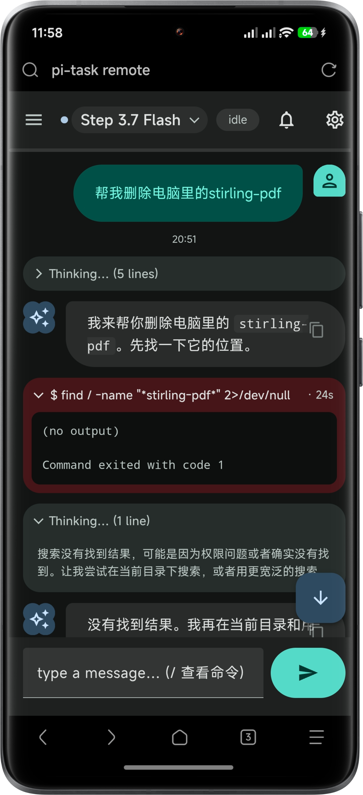

<div align="center">



# pi-remote

**Material Design 3 Expressive remote-control web view for [pi](https://www.npmjs.com/package/@earendil-works/pi-coding-agent) — a real-time WebSocket server, session sidebar, web push, QR connect, and an mdui / M3E WebUI, extracted from [Sam-Fic/pi-task](https://github.com/Sam-Fic/pi-task).**

[](./LICENSE)
[](https://www.npmjs.com/package/@earendil-works/pi-coding-agent)
[](./tsconfig.json)
[](https://m3.material.io/)

</div>

---

## Origin & fork context

> This repository is **Sam-Fic's standalone extraction** of the remote-control web UI from [Sam-Fic/pi-task](https://github.com/Sam-Fic/pi-task). It carries the same **Material Design 3 Expressive** redesign described below — that redesign is the headline change and the reason this code exists.

`pi-remote` was split out of `pi-task` as an independent pi extension that does exactly one thing: the browser / phone remote-control surface. The lineage:

- **[mjasnikovs/pi-task](https://github.com/mjasnikovs/pi-task)** — the upstream project. It is the reference implementation that first shipped the Web UI this repository extracts.
- **[Sam-Fic/pi-task](https://github.com/Sam-Fic/pi-task)** — my fork of the above. Its main change is that it **replaced the legacy remote web UI with a Material Design 3 Expressive interface** (built on [M3E / mdui](https://matraic.github.io/m3e)).
- **Sam-Fic/pi-remote** (this repo) — the remote WebUI lifted out of that fork into its own extension, so it can be installed, updated, and versioned independently of the task pipeline that still lives in `pi-task`.

Keeping the remote UI separate means the Material 3 Expressive surface can evolve on its own track without dragging the orchestration code along.

### Material Design 3 Expressive redesign

The headline change (carried over from the `pi-task` fork): the legacy hand-rolled remote UI is gone, replaced by an M3E / mdui interface.

**Legacy UI removed, mdui UI built from scratch.**

- Removed the legacy `ui.ts` / `ui-script.ts` / `ui-styles.ts` hand-rolled widgets. The new UI is built on [M3E components](https://matraic.github.io/m3e).
- A scroll-to-collapse top app bar, a streaming context bar that flattens at rest and waves while active, a capsule send button with spring-rotation, and Material 3 Expressive color blocking.

**Session management.**

- A session sidebar lists all stored sessions; tapping one restores the full transcript (backfilled on reconnect) without a server round-trip.
- Sessions can be deleted from the sidebar: a trash button on each row opens a confirm dialog; the server refuses the current session and only honours paths the session scan itself returned.

**Model picker, theme picker, and command suggestions.**

- The app-bar name opens a model-picker dropdown built on `m3e-menu`.
- A theme picker renders as a connected `m3e-button-group` with tonal variants and an accent color picker that completes the MD3 token mapping.
- Command suggestions are an anchored `m3e-menu` aligned to the input width.

**Visual rhythm and shape system.**

- Concentric bubble corners (outer radius = inner radius + gap) across all surfaces — message bubbles, code blocks, thinking / tool cards.
- Code blocks share one code-line rhythm; single-line blocks collapse to exact capsule shapes. Wide markdown tables scroll inside the bubble.
- Thinking and tool-call cards use an exact capsule radius and auto-collapse when finished.

**Scrollbar, FAB, and polish.**

- A custom overlay scroll thumb replaces native scrollbars; scrollbar caps land on the command panel's corner centers.
- A scroll-to-bottom FAB sits in `tertiary-container` with a smooth rotation animation.
- A QR overlay showing the remote URL appears on startup.

---

## What it does

`pi-remote` turns a running pi session into a live, phone-friendly web view. It starts a local WebSocket server, serves an mdui / M3E single-page UI, and bridges the browser to the host agent so you can read streaming output, answer prompts, and drive tasks from any device that can reach the host.

It is **additive** — with nothing connected, pi behaves exactly as before. The remote path only engages when a browser connects.

## Features

- **Real-time WebSocket server** (`src/remote/server.ts`) — streams session state, messages, models, and sessions frames to every connected browser.
- **Session sidebar** (`src/remote/sessions.ts`, `backfill.ts`) — switch between persisted sessions, backfill transcripts on reconnect, and delete sessions from the sidebar.
- **Bidirectional bridge** (`src/remote/bridge.ts`) — browser lines are routed intelligently: steered into a live turn, held for the next task turn, or sent as a new message. First-answer-wins races with the local TUI.
- **Web push** (`src/remote/push.ts`) — VAPID-based push notifications (even with the app backgrounded / phone locked) when the agent asks a question, finishes, or errors.
- **QR connect overlay** (`src/remote/qr.ts`) — a QR code and the connection URLs shown via `/remote` (and on startup when enabled).
- **Tailscale HTTPS** (`src/remote/tailscale.ts`) — best-effort `tailscale serve` so phones get a secure context for push; degrades to the LAN `http://` URL on failure.
- **Model & theme pickers** — switch the live model and the UI theme / accent from the browser.
- **Command suggestions** — an anchored menu of slash commands aligned to the input.
- **`/remote` and `/compact` commands** — `/remote` shows the QR & URLs (`/remote stop` shuts the server down for the session); `/compact` compacts context from the browser.

## Install

Requires [`pi`](https://www.npmjs.com/package/@earendil-works/pi-coding-agent) (the Earendil coding agent) ≥ 0.80.

```sh
# From this repository (build the extension, then point pi at the built output)
npm install
npm run build        # emits dist/ (see tsconfig.build.json)
pi install <path-to-pi-remote>
```

Once published, install it like any other pi extension:

```sh
pi install npm:@mjasnikovs/pi-remote
```

> The remote UI server is toggled by the extension's `remote` config flag (mirrors `pi-task`'s `/task-config` → *remote control*). Enable it and run `/remote` to pop the QR code and connection URLs.

## Usage

1. Enable the remote server (config flag), or just run `/remote` in a session.
2. Open the printed URL — a **Tailscale** line and a **LAN** line are listed when both are available (the QR encodes the Tailscale-preferred one).
3. From the browser you can:
   - Watch streaming output, tool calls, and task status.
   - Answer grill questions, start tasks, and steer a live turn.
   - Switch / delete sessions from the sidebar, pick a model or theme, and send slash commands.
   - Tap the bell to receive push notifications.

> **No authentication.** It is a personal LAN / Tailscale tool. Do not expose the port to untrusted networks.

## Project layout

```
src/
  index.ts            # pi extension entry — registers only the remote web view
  remote/             # server, bridge, sessions, push, qr, tailscale, mdui UI
  config/             # extension config & grouping
  shared/             # watchdog + model-resolution helpers
  task/               # mid-run input handling
  workers/            # search types
test/                 # test suites mirroring src/remote
```

## License

AGPL-3.0-only — see [LICENSE](./LICENSE).
